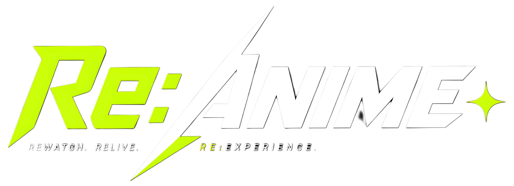

<div align="center">
  
  <p><strong>Your Ultimate Ad-Free Anime & Manga Streaming Experience</strong></p>
  
  <p>
    NOTE: This is not the real Re:Anime. This repo is not affiliated to or related to Re:Anime in any way.
  </p>

  <p>
    <a href="#key-features">Features</a> •
    <a href="#tech-stack">Tech Stack</a> •
    <a href="#installation--local-development">Installation</a>
  </p>
</div>

---

## 📖 Introduction

**Re:Anime** is a highly polished, feature-rich anime & manga platform built for fans who want a seamless, ad-free experience. It hooks into AniList and utilizes the Miruro API to provide a comprehensive anime library — along with a fully integrated manga reader — all wrapped in a gorgeous Glassmorphism user interface.

Our focus is entirely on usability, speed, and cross-platform consistency.

## ✨ Key Features

- **🚫 Ad-Free Streaming & Reading**: Pure entertainment without popups, redirects, or visual clutter.
- **📺 High-Quality Playback**: Fast streaming with multiple server options, subtitle/audio toggles, and quality selectors natively baked into the player.
- **⏭️ Intro & Outro Skip**: Smart episode intro and outro detection on the anime info page — skip straight to the action or the next episode with a single click.
- **📚 Manga Reader**: Browse, search, and read manga directly on Re:Anime with a clean, distraction-free chapter reader.
- **🔄 Two-Way Tracker Sync**: Link **AniList** account! The player will automatically update your viewing progress seamlessly in the background as you watch.
- **💬 Live Comments & Reactions**: Express yourself on episodes using the TAC comment system with integrated GIF support. Drop quick "likes" or "dislikes" on comments and specific episodes.
- **⏯️ Smart Resume**: Intelligent tracking remembers exactly what episode you were on. "Watch Now" will instantly drop you back into the action.
- **🎨 Modern UI/UX**:
    - **Glassmorphism Design**: Sleek, immersive dark-themed presentation.
    - **Spotlight Carousel**: Discover tracking information, genres, ratings, and studios right from the top page.
    - **Cinema Mode**: Distraction-free, immersive video player layout.
    - **Fully Responsive**: A premium and consistent experience whether you are on Desktop, Tablet, or Mobile.
- **🔐 Secure Authentication**: Includes full user accounts via client side Anilist integration
- **🔎 Advanced Discoverability**: Deep search, category filtering, schedule countdowns, and genre exploration.

## 🛠️ Tech Stack

- **JavaScript framework**:Nuxt JS 
- **Frontend**: VUE, HTML5, CSS3 , JavaScript
- **Data API**: AniList GraphQL

## 🚀 Installation & Local Development

Ready to run Re:Anime locally? Follow these steps:

1. **Clone the Repository**
    ```bash
    git clone https://github.com/Anikage-Group/Re:Anime
    cd Re:Anime
    ```

2. **Install Dependencies**
    ```bash
    npm install
    ```

3. **Set Up Environment Variables**
    Duplicate `.env.example` and rename it to `.env`. Fill in the required parameters:
    ```env
    # ==============================================================================
    # Status Redirect
    # ==============================================================================
    RESTATUS_URL="https://api.your-domain.com/"    
    # ==============================================================================
    # Streaming & Scraping Services
    # ==============================================================================
    MANGA_VAULT_API_BASE="https://api.your-domain.com/"
    PROXY_API_BASE="https://api.your-domain.com/"
    FLIXCLOUDMAP_URL="https://api.your-domain.com/"
    # ==============================================================================
    # OAuth Integrations: AniList
    # ==============================================================================
    # Create an API client at: https://anilist.co/settings/developer
    ANILIST_CLIENT_ID="YOUR_ANILIST_CLIENT_ID"
    ANILIST_CLIENT_SECRET="YOUR_ANILIST_CLIENT_SECRET"
    ANILIST_REDIRECT_URI="https://your-domain.com/callback"


    ```

4. **Run the Application**
    ```bash
    npm run dev
    ```
    Access the application right from your browser at `http://localhost:3000`.

## ⚙️ Integrations Setup Notes

- **Flixcloud API**: You'll need access to a Flixcloud-compatible data API instance for anime indexing and m3u8 stream resolution. This can be found at our Github Page
- **AniList**: Go to their respective Developer Portals, create a new application, and match the OAuth Redirect URIs to your `.env` values. 

## 📜 License

This project is open-source and available under the [MIT License](LICENSE).

---

<div align="center">
  <p>Made with ❤️ for the Anime & Manga Community and the Anikage Group</p>
</div>
